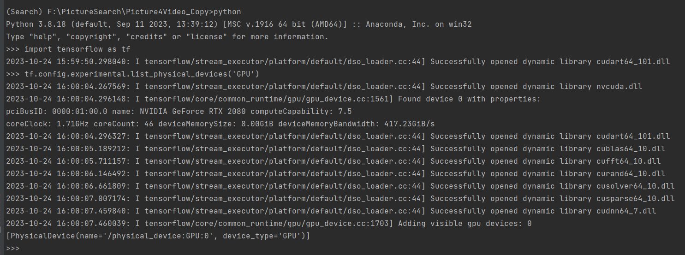

# Face

### 环境安装
#### Milvus安装
  - 安装Milvus版本2.2.9
  - 单机安装：https://milvus.io/docs/install_standalone-docker.md
  - 集群安装：https://milvus.io/docs/install_cluster-milvusoperator.md
  - Milvus可视化管理工具 Attu: https://github.com/zilliztech/attu
#### 人脸项目环境配置
  安装annconda，后创建python版本为3.8的虚拟环境，之后在该虚拟环境内安装以下包
  - 与本机环境适配的pytorch和cuda版本，开发时使用的版本为torch2.0，https://pytorch.org/get-started/locally/
  - 安装onnx， pip install onnx -i https://pypi.tuna.tsinghua.edu.cn/simple
  - 安装onnxruntime-gpu, pip install onnxruntime-gpu -i https://pypi.tuna.tsinghua.edu.cn/simple
  - 安装opencv，pip install opencv-python==4.8.0.74 -i https://pypi.tuna.tsinghua.edu.cn/simple
  - 安装av， pip install av==10.0.0 -i https://pypi.tuna.tsinghua.edu.cn/simple
  - 安装pymilvus，版本要符合跟Milvus版本的对于关系，pip install pymilvus==2.2.9 -i https://pypi.tuna.tsinghua.edu.cn/simple
  - 安装pyyaml，pip install pyyaml==6.0 -i https://pypi.tuna.tsinghua.edu.cn/simple

#### 视频检索项目环境配置
  安装annconda, 后创建python版本为3.8的虚拟环境，之后在该虚拟环境内安装以下包
  - tensorflow-gpu安装及验证
    - conda install cudatoolkit=10.1 cudnn=7.6.5
    - pip install tensorflow-gpu==2.2.0 -i https://pypi.tuna.tsinghua.edu.cn/simple
    - pip install protobuf==3.20.3 -i https://pypi.tuna.tsinghua.edu.cn/simple
    - pip install numpy==1.20.3 -i https://pypi.tuna.tsinghua.edu.cn/simple
    - 验证tensorflow-gpu是否安装成功
      - python
      - import tensorflow as tf
      - tf.config.experimental.list_physical_devices('GPU')
      (安装成功.png)
  - 安装opencv，pip install opencv-python==4.8.0.76 -i https://pypi.tuna.tsinghua.edu.cn/simple
  - 安装av, pip install av==8.0.3 -i https://pypi.tuna.tsinghua.edu.cn/simple
  - 安装pymilvus, 版本要符合跟Milvus版本的对于关系，pip install pymilvus==2.2.9 -i https://pypi.tuna.tsinghua.edu.cn/simple 
  - 安装PyMySQL, pip install PyMySQL==1.1.0 -i https://pypi.tuna.tsinghua.edu.cn/simple

### 人脸项目结构
+ config/weights存放模型权重 config/config.yml 存放配置信息 config/warm_up.jpg是用于预热模型的输入图片 config.config.get_config 返回配置信息
+ 模型权重 https://drive.google.com/drive/folders/1cPWvYTw2qOPVc8dP_EXHGjFTXk9o8HEz?usp=drive_link
+ model 包存放模型功能代码
+ init/initialize.py 用来初始化Milvus数据库中的表(collection)，安装完并启动Milvus后，执行initialize.py
+ milvus_tool包存放milvus数据库相关操作
+ utils包存放使用到的工具类
+ service/face_service 是人脸相关功能的接口

### 人脸项目说明
因为模型的加载，Milvus的连接和加载都需要在程序运行时保持状态，所以在程序时启动时需要加载模型和Milvus，在程序结束时要释放Milvus。
以python框架fastapi为例:
+ 在fastapi启动类开始时加载模型和Milvus：
  
+ 在fastapi类结束时释放Milvus:
  

### 人脸相关文档

#### 人脸模型部署概览：
  

#### 向量数据库Milvus:
  + 连接Milvus：https://milvus.io/docs/manage_connection.md
  + 数据库管理：https://milvus.io/docs/manage_databases.md
  + 表管理：https://milvus.io/docs/create_collection.md
  + 数据管理：https://milvus.io/docs/insert_data.md
  + 创建索引：https://milvus.io/docs/build_index.md
  + 向量搜索：https://milvus.io/docs/search.md
  + 备份：https://milvus.io/docs/milvus_backup_overview.md
  + pymilvus api：https://milvus.io/api-reference/pymilvus/v2.3.x/About.md

#### onnx
  + pytorch模型导出为onnx：https://learn.microsoft.com/zh-cn/windows/ai/windows-ml/tutorials/pytorch-analysis-convert-model
  + 博客：https://blog.csdn.net/weixin_42111770/article/details/127714640
#### onnxruntime：
  + python api: https://onnxruntime.ai/docs/api/python/api_summary.html
  + 知乎帖子：https://zhuanlan.zhihu.com/p/371177698

#### 模型pytorch源码：
  + 人脸识别 AdaFace: https://github.com/mk-minchul/AdaFace
  + 人脸检测 ReitnaFace/MobileFace: https://github.com/foamliu/MobileFaceNet
  + 人脸增强 GFPGAN: https://github.com/TencentARC/GFPGAN
  + 人脸质量评估 TFace: https://github.com/Tencent/TFace

#### 提取视频关键帧
  + 博客：https://blog.csdn.net/lidc1004/article/details/117528327

  
